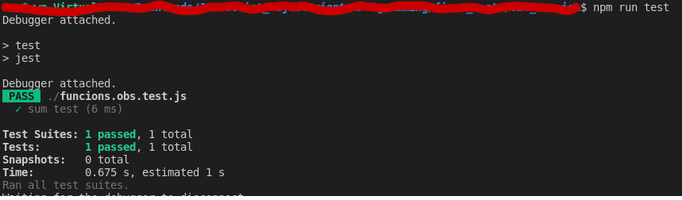

# Instruction for first graded exercise on OO JS

You will have **45** minutes to write code that will pass all **10** provided tests. \
File in which all test are written is called **functions.test.js**.\
The code for test is hashed, so You will not understand it's details. \

## How to create environment and run tests?
Those steps have been shown on 3th lesson of OOJS assignment.

Create empty folder.

Download provided **functions.test.js** file inside empty folder.

Install *jest* library in created folder running this command in terminal:\
``npm install --save-dev jest``

append the 
```
  "scripts": {
    "test": "jest"
  }
```

to the file *package.json* in folder where *jest* was installed.

To check if env is properly created run command: \
```
npm run test
```
It should return information that test have been runned. In example:\




# Assignment

You have to create a file called **functions.js** and in this file create and export all functions that are need by the test file **functions.test.js** ( downloaded from Assignment in MSTeams).\
Both of those files have to be inside same folder, Jest and NPM force this.

This is the link to the [Jest](https://jestjs.io/docs/getting-started) documentation. You can use it while working on code.

<span style="color:red">PLAGIARISM IS STRICTLY FORBIDDEN WILL BE TREATED AS FAILURE WITH NO POSSIBILITY TO ATTEND AT ANY RESIT FOR ALL INVOLVED </span>.


## 1 test
Create function named ```getEvenNumbers``` which will get two parameters as range, and return a integer of even numbers for provided range.

## 2 test
Create function named ```getOccurencesOfChar``` which will get two parameters, and return a number of occurrences of given character inside a provided str.

## 3 test
Create function named ```moveVector``` which will get three parameters, x coordinate, y coordinate and scalar, and return object ```{x:value, y:value}``` that contain value of moved vector positions x and y by given scalar.

## 4 test
Create function named ``arrayFunction`` which will get one parameter and return a function.\
If parameter passed to the function is even this function will return another function that will return a string *Is even*.\
if parameter is odd the function will return a function that will return a string *Not even*

## 5 test
Create function named ``switchFunction`` which will get one parameter.\
If parameter type is *string* this function will return ```'str'```\
If parameter type is *number* this function will return ```'numb'```\
If parameter type is *boolean* this function will return ```'bool'```\
in any other case this function will return ```'undefined'```

## 6 test
In ``switchFunction`` add code that:
If parameter type is *function* this function will call a function and return it's return value

## 7 test
Create function named ``fibonacci`` which will get one parameter, and return a fibonacci number of given parameter.

## 8 test
Create function named ``factorialize`` which will get one parameter, and return a factor of that number.

## 9 test
Create function named ``returnPowerOf`` which will get one parameter, and return a power of given parameter.

## 10 test
Create function named ``convertFtoC`` which will get one parameter,temperature given in Fahrenheit scale, and return a converted value of this temperature from Fahrenheit to Celsius scale.
